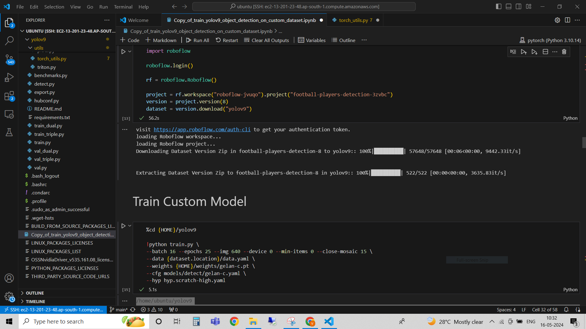
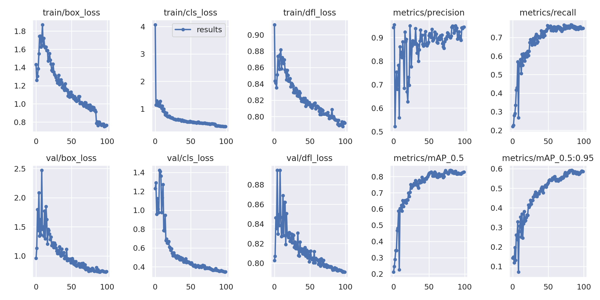
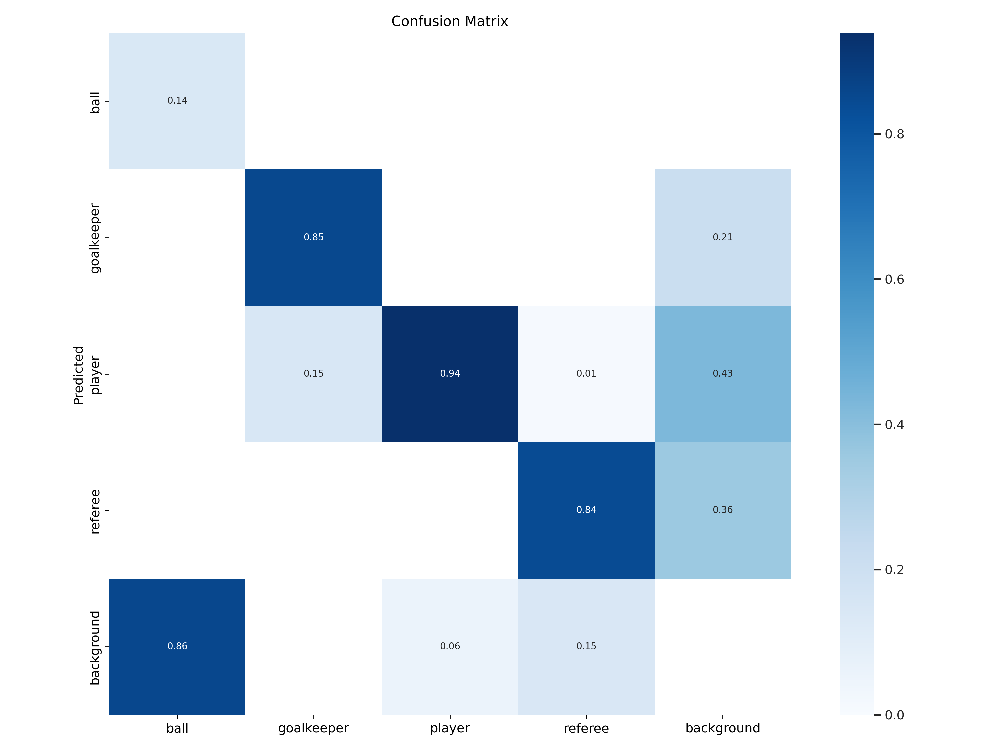
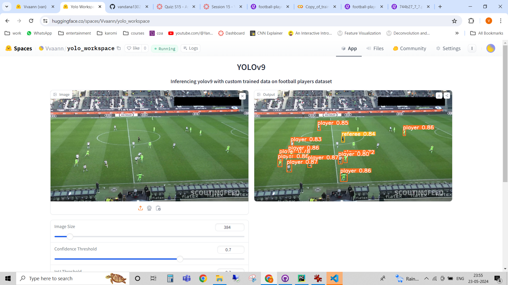

# Assignment 15

# Problem Statement

Train a custom yolov9 model in AWS and host the infernce in hugging spaces.

# Dataset

I've chosen the football players classification dataset from roboflow 

https://universe.roboflow.com/roboflow-jvuqo/football-players-detection-3zvbc

This dataset contains 4 classes:

    ball
    goalkeeper
    player
    refree
        
# Description

This repo contains two parts, 
    
1. One is the data training file **s15.ipynb** file which was first prepared on colab and then trained on aws ec2 instance for 100 epochs
2. Another is the inference of trained model in hugging face spaces with gradio app

The football player dataset was trained on yolov9 architecture as mentioned in S15.ipynb in EC2 instance. The respective screenshot is attached below:

    

With the trained model, I have inferenced in gradio app at hugging face spaces as below:

 https://huggingface.co/spaces/Vvaann/yolo_workspace

# Results

This data was trained for 100 epochs
Training loss and metrics

    

Confusion matrix

    

Kindly refer the spaces link for inference

    

